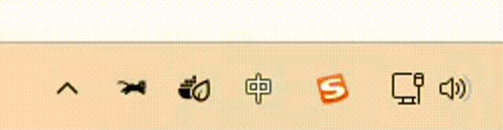

# GoRunCat

一个模仿 [RunCat](https://github.com/Kyome22/RunCat_for_windows) 的跨平台系统托盘应用，使用 Go 语言开发。显示一个随 CPU 负载变化速度的动画猫咪。

## 功能特性

- 系统托盘动画猫咪，速度随 CPU 负载变化
- 支持 Windows 和 macOS
- 自动适应系统深色/浅色主题
- 支持开机自启动设置
- 快速访问系统任务管理器

# Demo



## 安装

### 从发布版本安装

1. 访问 [Releases](https://github.com/eatmoreapple/go-runcat/releases) 页面
2. 下载适合您系统的最新版本
3. 解压并运行应用程序

### 从源码构建

确保已安装 Go 1.24 或更高版本：

```bash
git clone https://github.com/eatmoreapple/go-runcat.git
cd go-runcat
go build -o runcat cmd/runcat/main.go
```

在 Windows 上构建时，可以添加窗口模式标志：

```bash
go build -ldflags="-H=windowsgui" -o runcat.exe cmd/runcat/main.go
```

## 使用方法

运行应用后，一个动画猫咪图标将出现在系统托盘中。

右键点击托盘图标可以访问以下选项：
- 切换开机自启动
- 打开任务管理器
- 退出应用

## 系统要求

- Windows 10/11
- macOS 10.13+
- Go 1.24+ (仅用于从源码构建)